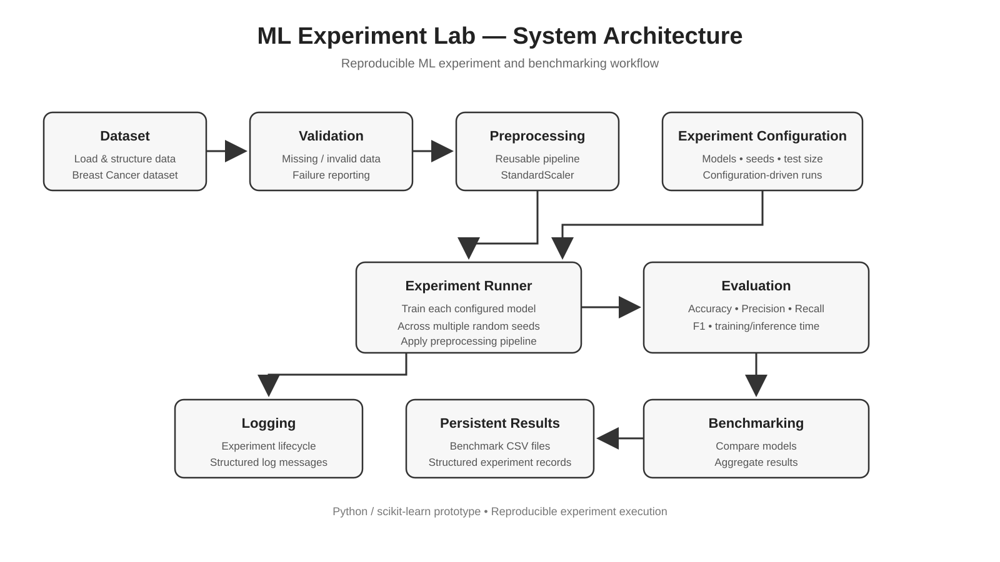

# ML Experiment Lab

A reproducible machine learning experiment and benchmarking system designed to automate model evaluation across controlled configurations and random seeds.

## Overview

ML Experiment Lab provides a structured workflow for running, evaluating, benchmarking, and recording machine learning experiments.

The project demonstrates:

* Dataset validation
* Reusable preprocessing
* ML experiment execution
* Multi-model benchmarking
* Reproducible random seeds
* Configuration-driven experiments
* Experiment logging
* Structured experiment records
* Result persistence

## Experiment Workflow

```text
Dataset
   ↓
Validation
   ↓
Preprocessing
   ↓
Experiment Runner
   ↓
Evaluation
   ↓
Benchmarking
   ↓
Persistent Results
```

### Architecture



The experiment runner executes each configured model across multiple random seeds, while the evaluation and benchmarking stages collect performance and execution metrics.

## Models

The current benchmark includes:

* Logistic Regression
* Random Forest

Each model is evaluated using three random seeds:

* 42
* 123
* 456

## Metrics

Each experiment records:

* Accuracy
* Precision
* Recall
* F1 score
* Training time
* Inference time

This allows both predictive performance and execution efficiency to be compared.

## Dataset

The current prototype uses the **Breast Cancer Wisconsin dataset** provided by scikit-learn.

Before experiments are executed, the dataset is validated for:

* Empty datasets
* Feature/label length mismatches
* Missing values
* Infinite values
* Duplicate rows

Validation errors are explicitly reported through the experiment logging system.

## Benchmark Results

The experiment runner was evaluated using two classification models across three random seeds.

| Model               | Accuracy | Precision | Recall |     F1 | Avg. Training Time | Avg. Inference Time |
| ------------------- | -------: | --------: | -----: | -----: | -----------------: | ------------------: |
| Logistic Regression |   98.25% |    98.17% | 99.07% | 98.62% |            0.0201s |             0.0028s |
| Random Forest       |   96.49% |    96.81% | 97.69% | 97.24% |            0.3017s |             0.0089s |

Results are averaged across three random seeds: 42, 123, and 456.

In this benchmark, Logistic Regression achieved higher average accuracy and F1 score while requiring substantially less training and inference time than Random Forest.

## Experiment Configuration

Experiments can be controlled through a configuration dictionary specifying:

* Random seeds
* Test set size
* Models to evaluate

This separates experiment configuration from execution logic and makes it easier to reproduce or extend benchmark runs.

## Result Persistence

The project stores experiment outputs as CSV files, including:

* `benchmark_results.csv` — individual experiment results
* `benchmark_summary.csv` — aggregated benchmark metrics
* `configured_benchmark_results.csv` — results from the configuration-driven benchmark
* `experiment_records.csv` — structured experiment records with timestamps and configuration information

## Technologies

* Python
* NumPy
* Pandas
* scikit-learn
* Google Colab

## Project Structure

```text
ML Experiment Lab
│
├── ML Experiment Lab.ipynb
├── README.md
├── requirements.txt
│
├── benchmark_results.csv
├── benchmark_summary.csv
├── configured_benchmark_results.csv
├── experiment_records.csv
│
└── ml_experiment_lab_architecture.svg
```

## Reproducibility

Experiments use explicit random seeds and controlled configurations to make benchmark runs reproducible.

The notebook contains the complete experiment workflow, while the generated CSV files provide persistent records of the benchmark outputs.

## Project Status

The current version is a functional prototype implemented in Google Colab.

The project is designed to be extended into a more modular experiment system with reusable Python modules, containerized execution, and additional infrastructure components.
